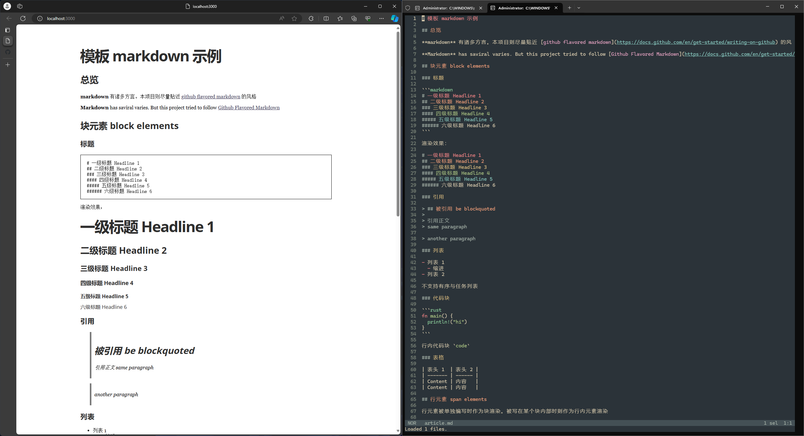

# render_on_save

保存 markdown 文件后，实时将其自动渲染在浏览器中

## 用法

```bash
git clone https://github.com/mofee-11/render_on_save.git
cd render_on_save
npm i browser-sync
browser-sync start --cors --server --files "**/*"
```

然后根据提示，访问本地链接。例：`http://localhost:3000`

编辑 `article.md` 后保存即可看到浏览器自动渲染新的改动

## 示例截图


